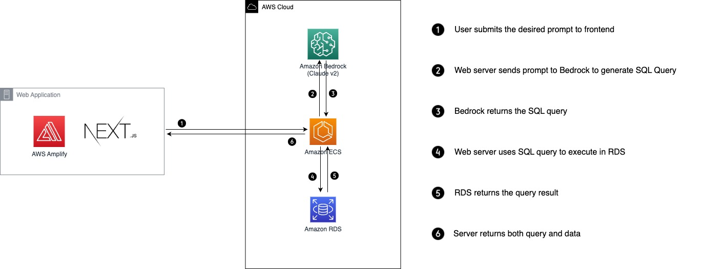
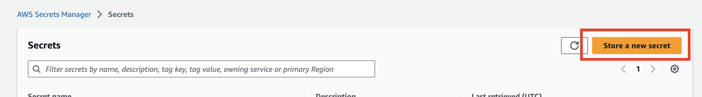
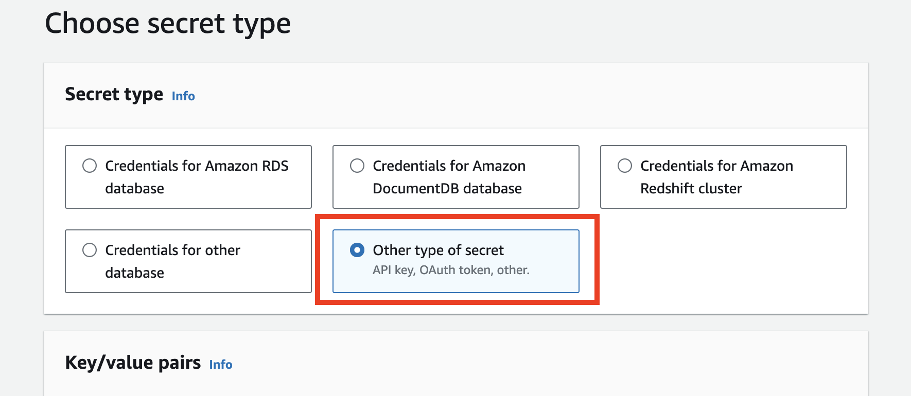
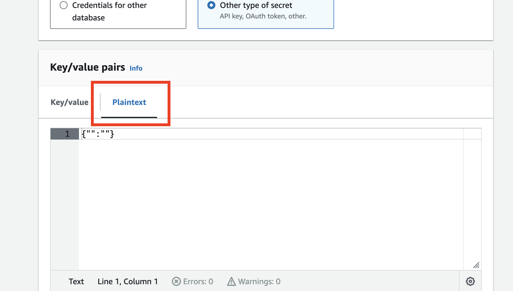

# NQL

In recent years, the modernization of data has become pivotal for driving informed decision-making and innovation in organizations. However, extracting insights often relies on a small number of personnel with specialized SQL skills, creating friction and delays in accessing meaningful information. NQL aims to democratize data-driven insights across organizations by using Generative AI to bridge the gap between natural language and SQL. Operating like a search engine, it allows any user to input questions in plain language and automatically generates queries to retrieve the desired data. This streamlines and opens up data access to all members of an organization, enhancing agility and facilitating data-driven decision making.

## Table of Content

- [Project Status](#project-status)
  - [Supported Data Sources](#supported-data-sources)
- [Project Architecture](#project-architecture)
- [Prerequisites](#prerequisites)
- [Setup](#setup)
  - [Install Dependencies](#install-dependencies)
  - [Run Local Server](#run-local-server)
    - [Localhost](#local)
    - [Docker Compose](#docker-compose)
- [Advanced Setup](#advanced-setup)
  - [SQL data with RDS PostgreSQL](#sql-data-with-rds-postgresql)
    - [Pagila](#pagila-movie-rental-company-data)
    - [Temenos](#temenos-data)
  - [Storing Database Credentials](#storing-database-credentials)
  - [ECS Deployment](#ecs-deployment)

<a id="project-status"></a>
## Project Status

The project is currently in late stage of development. While there are something yet to be improved on, it's a fully working demo that can be used commercially.

<a id="supported-datasources"></a>
### Supported Data Sources
Currently, NQL supports querying:

- Amazon Athena
- PostgreSQL

Other Relational Databases are not supported as of current time. 

<a id="project-architecture"></a>
## Project Architecture



<a id="prerequisites"></a>
## Prerequisites

- Python >= 3.9
- Docker
- AWS CLI

<a id="setup"></a>
## Setup

<a id="install-dependencies"></a>
### Install Dependencies

You can use either plain python, venv, or conda. Assuming that this is an option for you to choose.

```bash
./setup.sh
```

If you want to use jupyter notebooks for testing, you can create `.ipynb` notebooks in `/notebooks` directory and download the necessary dependency
```bash
pip install -r requirements-dev.txt
```

<a id="run-local-server"></a>
### Run Local Server

To connect to RDS locally, we recommend using an EC2 bastion host due to its simplicity. However, due to security compliance _**do not**_ set ingress network to allow for all connections from port 22. Instead use AWS System Manager to access through SSH. Refer to this Article: [Use port forwarding in AWS Systems Manager Session Manager to connect to remote hosts](https://aws.amazon.com/blogs/mt/use-port-forwarding-in-aws-systems-manager-session-manager-to-connect-to-remote-hosts/)

Use this script to run port tunneling through bastion host.
```bash
aws ssm start-session --target <ec2_instance_id> --document-name AWS-StartPortForwardingSessionToRemoteHost --parameters '{"portNumber":["<port_number>"],"localPortNumber":["<port_number>"],"host":["<host>"]}
```
<a id="local"></a>
#### Localhost

```bash
make run
```

<a id="docker-compose"></a>
#### Docker-compose
```bash
docker-compose up
```

<a id="advanced-setup"></a>
## Advanced setup

The main components of the backend to configure include:
- The server, which runs on Elastics Container Service (ECS)
- The datasource, in this case we'll use PostgreSQL RDS

<a id="sql-data-with-rds-postgresql"></a>
### SQL data with RDS PostgreSQL

Just create a RDS cluster and select to store the credentials inside SecretsManager. The Secret name will be refered inside the environment envariable to be retrieved by the application.
Import any data that you like into your RDS database.

<a id="pagila"></a>
#### Pagila (Movie Rental Company Data)

For the purpose of having some sample data we recommend using [Pagila for PostgreSQL](https://github.com/devrimgunduz/pagila).
Import can be done from a EC2 instance using the following commands:

```bash
psql -U postgres -d <DATABASE_NAME> -f /tmp/psql_data/pagila-schema.sql;
```
```bash
psql -U postgres -d <DATABASE_NAME> -f /tmp/psql_data/pagila-insert-data.sql;
```

<a id="temenos"></a>
#### Temenos Data

For temenos data, the sql dump file is already inside Amazon Workdocs, please refer to the temenos.nql file for dumping data. 

```bash
psql -U postgres -d <DATABASE_NAME> -f /tmp/psql_data/temenos.sql;
```

<a id="storing-database-credentials"></a>
### Storing Database Credentials

Navigate to AWS Secrets Manager in AWS console and click `Store a new secret`.



In `Secret Type` section, select `Other type of secret`



In `Key/value pairs`, select `Plaintext` section.



Fill in the database credentials in JSON format below and paste in `Plaintext` section.

```json
{
    "host": "DB_HOST_NAME",
    "username": "DB_USERNAME",
    "password": "DB_PASSWORD",
    "engine": "postgresql",
    "port": "DB_PORT",
    "dbname": "DB_NAME"
}
```

Enter Secret name and create the secret. Copy the ARN and paste it in `RDS_SECRETS_MANAGER_ARN` as the value of the environment variable.

<a id="ecs-deployment"></a>
### ECS Deployment

Please refer to this tutorial: [Deploy Docker Containers with AWS ECS & Fargate](https://aws.plainenglish.io/deploying-nginx-webserver-containers-using-aws-ecs-fargate-f6fb8ea2e2f3)